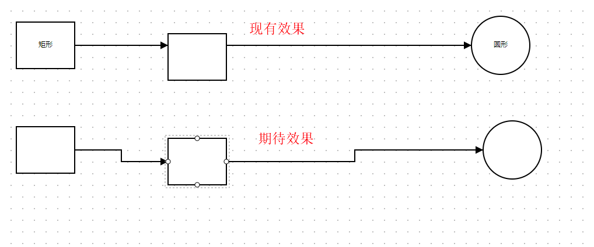

# didi/LogicFlow/issues解决记录

- 查找git提交记录找到`issue`涉及到的相关文件
- 对相关文件进行`debugger`断点调试，弄清楚逻辑
- 尝试修复代码
- 修复成功后，弄清楚`issue`出现的来龙去脉，比如由什么事件触发，为什么要这样写，会导致什么逻辑发生改变
- 进行`pull request`
> 自己项目clone项目的master应该同步didi/LogicFlow的master，然后新起分支进行修复`issue`

## [issues/1150](https://github.com/didi/LogicFlow/issues/1150)

### 1.问题描述

边上插入节点插件能否支持自动链接到对应的锚点

### 2. 问题分析

提供吸附效果，连线在锚点附近时自动吸附

### 3. 解决步骤
> 先弄清楚如何进行连线，涉及到什么文件？什么方法？什么逻辑？ 
> 
> 然后研究下吸附效果目前主流的判定，比如判定距离，判定逻辑等等

1. 拿到一个形状的四个锚点
- 基础图形管理类`BaseNode.tsx`是否有`getAnchor`或者`mouseEnter`事件？
- 从`BaseNode.tsx`拿到`model.anchors`存放了4个锚点的值

2. 拿到连线的最终的endPoint
- 从`PolylineEdgeModel.ts`的`dragAppend()`可以拿到`endPosition`

3. 比对endPoint跟四个锚点之间的距离，进行吸附
